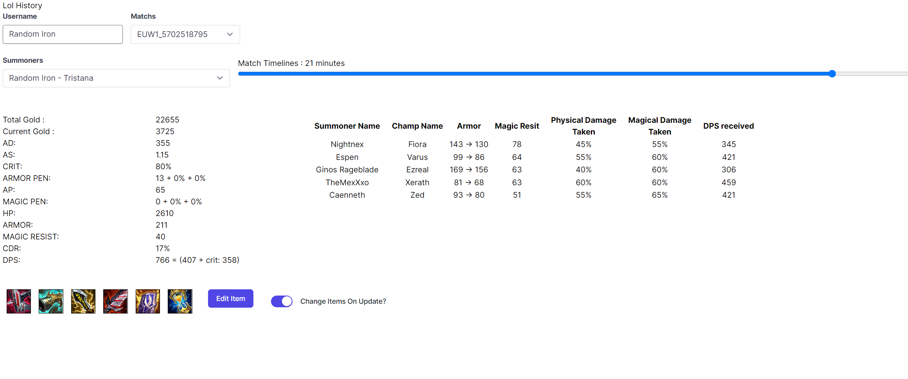
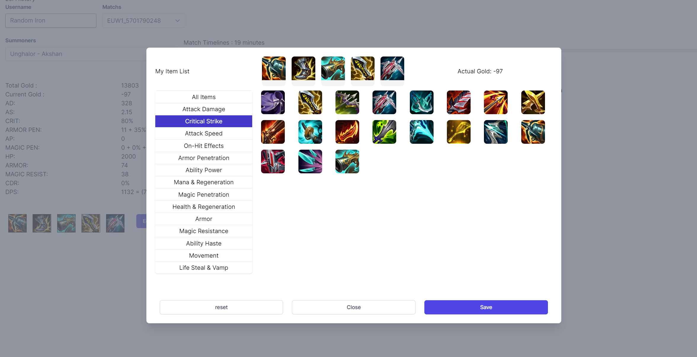

## Website to do theory craft on euw League of Legend match history timeline



 

## Installation
copy .env.exemple as .env and configure it to your needs (DB and RIOT_API_KEY)
```bash
composer install
php artisan optimize

npm install
npm run dev

php artisan serve
```

## Future improvements
- [x] add popup items stats
- [x] add mythic stats in calculation (scraping)
- [x] runes are calculated but cannot be changed
- masteries
- add onHit damage in dps (guinsoo already done)
- add items passive / active  and champs spells for Combo damage 
